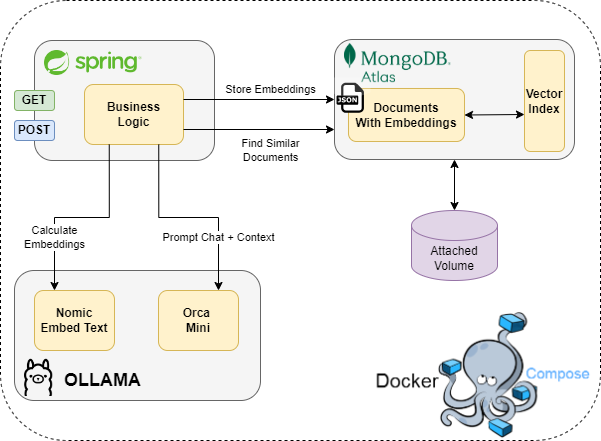

## **RAG With Java, Atlas and Ollama**

This codebase contains a Spring microservice which provides a simple RAG application using:

- **Atlas**: it provides the storage layer and vector search engine for similarity searches.
- **Ollama**: it provides LLM models for embeddings and chats; in particular this project refers to nomic-embed-text (embeddings) and orca-mini (chatting).

The Spring microservice exposes the following REST APIs:
- **POST /v1/documents**: it's a multipart API which aim to load PDF documents and store them within a MongoDB collection.
- **GET /v1/documents**: it allows user to send search requests containing a text prompt and some additional filters. The response contains the LLM output.

Below the logical architecture:

<div align="center">
  <picture>
    <source media="(prefers-color-scheme: dark)" srcset="images/rag_architecture.png">
    
  </picture>
</div>

---

### 🚀 **Getting Started**

In order to start this service there is one pre-requisite: **install docker**.
If you are using Windows you can refer to WSL2 before installing docker.

After installing docker you have to build the docker images related to the Spring service and Ollama customization:
1) Spring: locate the folder /containers/vectorsearch and run ```docker build . -t application/vector-search-java-app```
2) Ollama: locate the folder /containers/ollama and run ```docker build . -t ollama/ollama-nomic-embed```

**Note:** you can change docker images tag but remember to reflect these changes within the docker compose yaml file.

#### How to start application?

To start application you have to locate **/containers** folder and then execute ```docker-compose up -d```. In this way
you will run all containers (Spring, Atlas, Ollama).

The docker compose file has been written managing the dependencies between containers using a healthcheck approaches.
In this way the Spring service will start after Atlas and Ollama containers.

#### How to use application?

Spring service expose two REST APIs which allow users to load PDF documents and ask question about them:

**POST /v1/documents**: allow users to load PDF documents using multiparts form. Example:
```bash

curl --location 'http://localhost:8080/v1/documents' \
--form 'fileMetadata="{\"title\": \"Storia dei computer\", \"author\": \"Copilot\", \"publicationDate\": \"2024-11-25T15:54:17Z\"}"' \
--form 'file=@"<file_location>.pdf"'
```

**GET /v1/documents**: allow users to ask questions about documents stored within the vector search index. Example:
```bash

curl --location 'http://localhost:8080/v1/documents?prompt=in%20che%20secolo%20Pascal%20invento%20le%20addizioni'
```

### 📘 **What's next?**
This application is only an example about using a vector store to use LLM with custom data, but obviously it cannot scale
in a production environment.

Some possible enhancements:
- Use an event-driven architecture with a queue behind microservice, in order to perform backpressure while loading files.
  - Example: load files within an S3 bucket and push an event on SQS to notify the service that a new file is ready to be stored
- Use chunking strategy to optimize embedding process